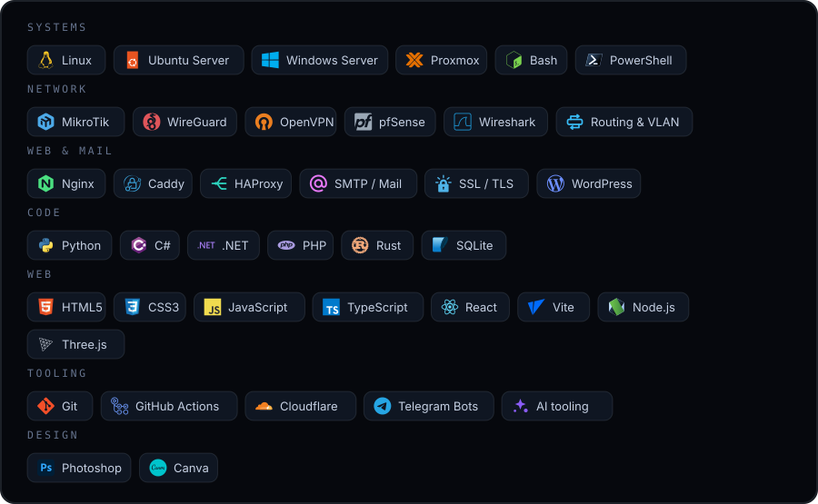

<div align="center">



<br>

[English](./README.md) · [فارسی](./README.fa.md) · **العربية** · [Deutsch](./README.de.md)

<br>

<a href="https://ateight.xyz"></a> <a href="https://ateight.xyz/links/"></a> <a href="https://t.me/AteightTech"></a> <a href="mailto:ateight088@gmail.com"></a>

</div>

---

أصمّم وأشغّل وأستكشف أعطال البنية التحتية للأعمال — الشبكات والخوادم والوصول الآمن وخدمات الويب والبريد والنسخ الاحتياطي والمراقبة — وأوثّق كل ما أبنيه. وإلى جانب ذلك: تصميم الويب والعروض التقنية والمخططات التي تجعل الأنظمة المعقّدة مقروءة.

النسخة الكاملة مع دراسات الحالة على **[ateight.xyz](https://ateight.xyz)**

### الأدوات



### المسار



### المشاريع

- **[NetDoctor](https://ateight.xyz/NetDoctor/)** — تشخيص شبكة Windows مع إصلاح قابل للتراجع
- **[KeyFix](https://github.com/miladateight/KeyFix)** — تصحيح الكتابة بلغة لوحة مفاتيح خاطئة، دون اتصال · [الصفحة](https://ateight.xyz/KeyFix/)
- **[PDF Sanitizer](https://ateight.xyz/PDF-Sanitizer/)** — بحث واستبدال وحذف جماعي في ملفات PDF الكبيرة
- **[AI RTL Fixer](https://github.com/miladateight/AI.RTL.Fixer)** — إصلاح العرض من اليمين إلى اليسار في تطبيقات الدردشة · [الصفحة](https://ateight.xyz/AI-Chat-RTL-Fixer/)
- **[Hybrid Web &amp; Mail Infrastructure](https://github.com/miladateight/hybrid-web-mail-infrastructure)** — دراسة حالة إنتاجية: استضافة، بريد، HAProxy، WireGuard · [الصفحة](https://ateight.xyz/hybrid-web-mail-infrastructure/)
- **[Media Downloader Bot](https://github.com/miladateight/instagram-youtube-soundcloud-downloader)** — بوت Telegram مع تفعيل المشرف وإدارة Cookies · [الصفحة](https://ateight.xyz/instagram-youtube-soundcloud-downloader/)

### النشاط

<div align="center">

<picture>
  <source media="(prefers-color-scheme: dark)" srcset="https://raw.githubusercontent.com/miladateight/miladateight/output/snake-dark.svg">
  <source media="(prefers-color-scheme: light)" srcset="https://raw.githubusercontent.com/miladateight/miladateight/output/snake.svg">
  
</picture>

</div>

### التواصل

**[ateight.xyz](https://ateight.xyz)** · [كل الروابط](https://ateight.xyz/links/) · [ateight088@gmail.com](mailto:ateight088@gmail.com)

لدعم أعمالي العامة عبر شبكة `TRON / TRC20` — يرجى التحقق من العنوان والشبكة قبل الإرسال:

```text
TUvALYktfdXb9h7HpQrnjfYrfjACucw6BY
```

<div align="center">
<br>
<sub><code>ateight.xyz</code> · تصميم وتطوير وصيانة: Milad Ateight</sub>
</div>
